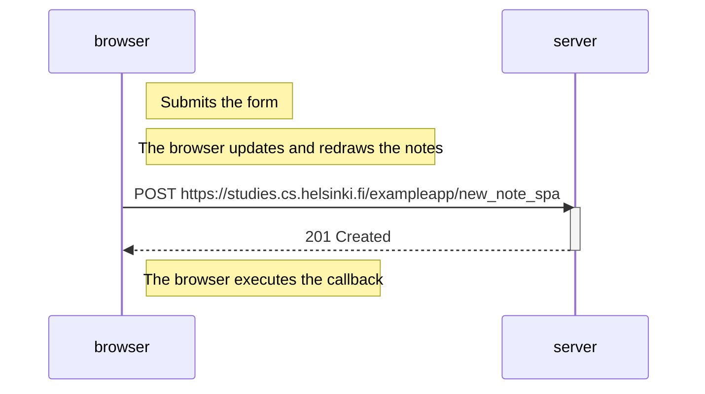

# Exercise 0.6

```mermaid
sequenceDiagram
    participant browser
    participant server

    Note right of browser: Submits the form
    Note right of browser: The browser updates and redraws the notes

    browser->>server: POST https://studies.cs.helsinki.fi/exampleapp/new_note_spa
    activate server
    server-->>browser: 201 Created
    deactivate server

    Note right of browser: The browser executes the callback 
```
