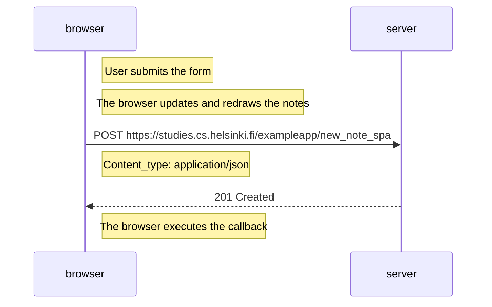

# Exercise 0.6

```mermaid
sequenceDiagram
    participant browser
    participant server

    Note right of browser: User submits the form
    Note right of browser: The browser updates and redraws the notes

    browser->>server: POST https://studies.cs.helsinki.fi/exampleapp/new_note_spa

    Note right of browser:  Content_type: application/json

    server -->> browser: 201 Created


    Note right of browser: The browser executes the callback
```
